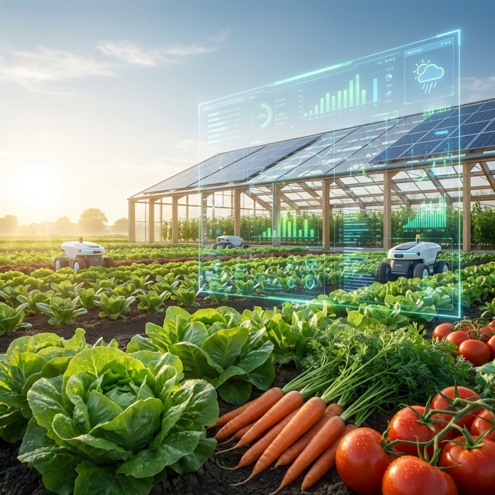
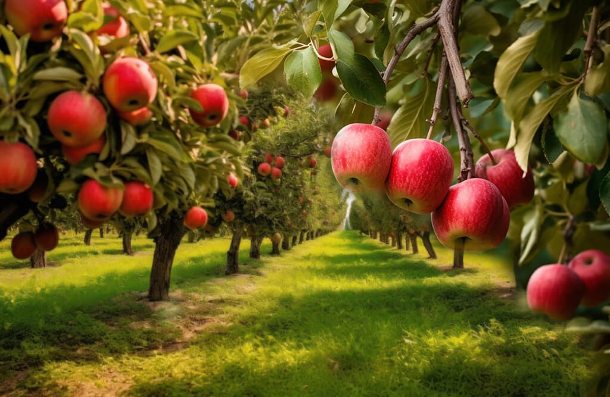
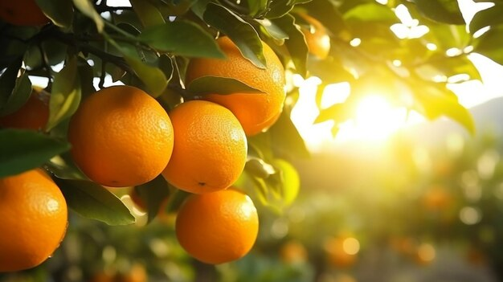
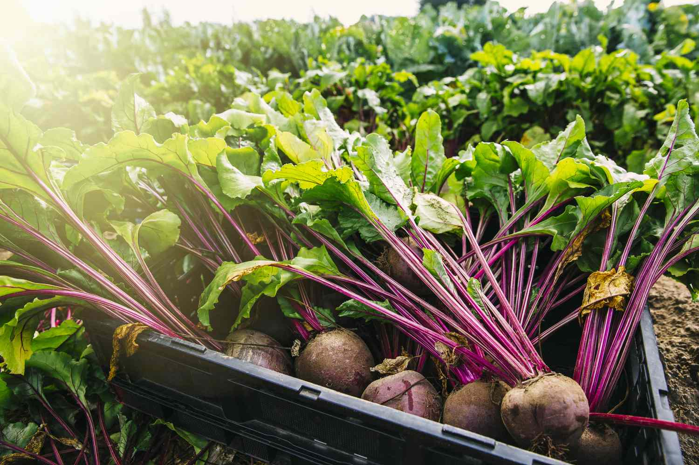

# 🌾 FarmerMarketPlace (FARMER 2 BUYER)



**Empowering the Roots, Feeding the Future.**

The next-generation marketplace connecting local farmers directly with buyers through AI-driven insights and secure, transparent transactions.

## ✨ Features

- **🤝 Fair Pricing**: Farmers set their own prices. Buyers get market-best rates directly from the source.
- **🧠 AI Insights**: Smart tools for price prediction and crop disease detection to help farmers succeed.
- **🛡️ Secure Platform**: Verified users and transparent transactions ensure a safe marketplace for all.

## 👥 User Roles

1. **Farmer 🚜**: List your harvest, manage sales, and access AI tools for better yields.
2. **Buyer 🛒**: Discover fresh local produce and make offers directly to farmers.
3. **Admin 🛡️**: Platform management, user verification, and transaction oversight.

## 🛠️ Tech Stack

- **Backend**: Python, Flask
- **Database**: SQLAlchemy (Flask-Migrate)
- **Machine Learning**: Scikit-Learn, XGBoost, Pandas, Numpy (For Price Prediction & Disease Detection)
- **Frontend**: HTML5, CSS3, JavaScript (Jinja2 Templates)

## 🚀 Installation & Setup

1. **Clone the repository**
   ```bash
   git clone https://github.com/manjeet266/FarmerMarketPlace.git
   cd FarmerMarketPlace
   ```

2. **Create a virtual environment (optional but recommended)**
   ```bash
   python -m venv venv
   venv\Scripts\activate
   ```

3. **Install dependencies**
   ```bash
   pip install -r requirements.txt
   ```

4. **Run the Application**
   You can run the application using python directly:
   ```bash
   python run.py
   ```
   *or by simply double-clicking:*
   ```bash
   start_app.bat
   ```

5. **Open in Browser**
   Navigate to `http://localhost:5000`

## 📸 Sample Products

<div align="center">
  
  
  
</div>

---
*Built with ❤️ for our local farmers.*
